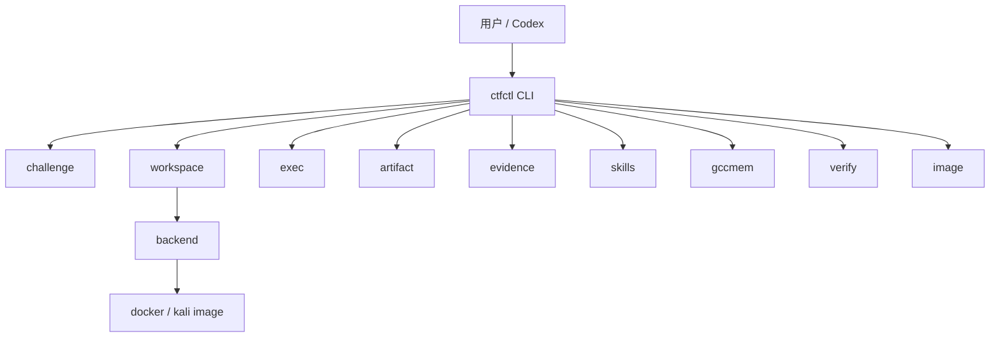
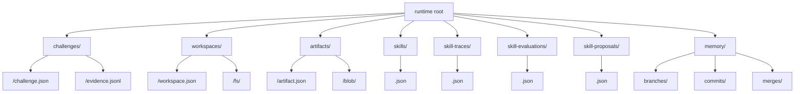
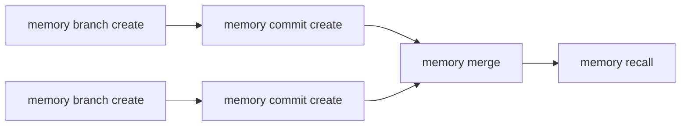
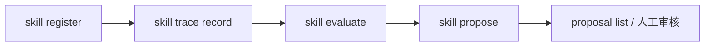

# ctfctl

`ctfctl` 是一个给 Codex 使用的本地 CTF 控制面 CLI。它的目标是提供稳定、结构化、可审计的命令协议，让 Codex 能在受控环境里创建题目、管理工作区、执行命令、登记证据、管理 artifact，并使用带 `branch / commit / merge` 语义的 gccmem。

如果你想一眼看懂整个项目，先看 [项目总览](</Users/zuens2020/Documents/CTF-agent/docs/项目总览.md>)。

## 安装

```bash
npm i -g ctfctl
```

## 总体结构



## 当前能力

- `challenge init`：创建题目记录
- `workspace create / destroy`：创建或销毁工作区
- `exec run`：在工作区内执行命令
- `artifact add / list`：导入并列出产物
- `evidence note`：登记证据
- `skill register / list / show`：管理结构化 skill
- `skill trace record / list`：记录与查看 skill 运行轨迹
- `skill evaluate`：对 skill 运行结果打分
- `skill propose / proposal list`：生成与查看演化提案
- `memory branch create`：创建 gccmem 分支
- `memory commit create`：向分支提交解题记忆
- `memory merge`：合并分支
- `memory recall`：按查询词召回记忆提交
- `image ensure / list`：管理 Docker/Kali 镜像记录
- `verify flag`：校验 flag 候选

## Runtime 目录



## 输出协议

所有命令都返回统一 JSON envelope。

成功：

```json
{
  "ok": true,
  "data": {},
  "meta": {
    "schemaVersion": "1",
    "command": "workspace create"
  }
}
```

失败：

```json
{
  "ok": false,
  "error": {
    "code": "WORKSPACE_NOT_FOUND",
    "message": "Workspace not found: ws-missing"
  },
  "meta": {
    "schemaVersion": "1",
    "command": "exec run"
  }
}
```

## 后端

当前只支持 `docker` 后端：

- `docker`：`workspace create` 会创建持久 Docker 容器，并将工作区挂载到容器中
- 容器以后台方式保持运行，供后续 `exec run` 复用
- `exec run` 在已有 workspace 容器内执行命令，而不是每次创建临时容器
- `workspace stop/start/destroy` 用于停止、启动或销毁 workspace 容器生命周期
- `workspace.backend` 在输出协议里固定为 `"docker"`
- `workspace destroy` 会删除对应 Docker 容器，但不主动删除工作区文件

默认配置：

- `runtimeRoot = <当前工作目录>/.ctfctl-runtime`
- `backend = docker`
- `docker.image = kali/rolling`
- `docker.workdir = /workspace`

推荐用 CLI 配置，而不是直接依赖环境变量：

```bash
ctfctl config show
ctfctl config set docker.image kali/rolling
ctfctl config set docker.workdir /workspace
```

首次使用也可以走交互式向导：

```bash
ctfctl setup
```

环境变量仍然保留为兼容覆盖层，但不再是推荐主配置方式。

Docker 模式要求本机 Docker daemon 可用。`image ensure` 会拉取镜像并登记到本地 runtime。`workspace create` 会创建一个持久 workspace 容器并在后台保持运行；后续 `exec run` 会在该已有容器内执行命令，而不是通过 `docker run --rm` 每次创建临时容器。可使用 `workspace stop/start/destroy` 管理容器生命周期。

## Codex 启动 Skill

仓库内置了一个给 Codex 使用的 bootstrap skill：

- `.agents/skills/ctf-solving-with-ctfctl/SKILL.md`

它的目标是让用户只提供题目描述、附件和 URL，Codex 就能直接：

- 初始化 `challenge / workspace / gccmem`
- 导入附件为 `artifact`
- 记录初始 `evidence`
- 确保 Docker 镜像可用
- 自动开始首轮侦察与持续解题

## gccmem 流程



## skills 自进化流程



## 常用命令

创建题目：

```bash
ctfctl challenge init \
  --name "local music" \
  --category reverse \
  --description "recover the song" \
  --flag-format 'flag{...}'
```

创建工作区：

```bash
ctfctl workspace create --challenge ch-xxxx
```

导入 artifact：

```bash
ctfctl artifact add --challenge ch-xxxx --file ./sample.bin
ctfctl artifact list --challenge ch-xxxx
```

执行命令：

```bash
ctfctl exec run \
  --workspace ws-xxxx \
  --cmd "file sample.bin" \
  --reason "识别文件类型"
```

最小 workspace / exec 流程：

```bash
ctfctl workspace create --challenge ch-xxxx
ctfctl exec run --workspace ws-xxxx --cmd "pwd"
ctfctl workspace stop --workspace ws-xxxx
ctfctl workspace start --workspace ws-xxxx
ctfctl workspace destroy --workspace ws-xxxx
```

记录证据：

```bash
ctfctl evidence note \
  --challenge ch-xxxx \
  --kind fact \
  --text "二进制看起来被打包过"
```

使用 gccmem：

```bash
ctfctl memory branch create --challenge ch-xxxx --name main

ctfctl memory commit create \
  --branch branch-xxxx \
  --challenge ch-xxxx \
  --message "spectrogram path" \
  --facts "先生成频谱图" \
  --hypotheses "高频区域可能藏字"

ctfctl memory merge \
  --challenge ch-xxxx \
  --source-branch branch-alt \
  --target-branch branch-main \
  --result-commit commit-xxxx \
  --summary "合并已验证路径"

ctfctl memory recall --query spectrogram
```

使用 skills：

```bash
ctfctl skill register \
  --name "reverse static baseline" \
  --version "1.0.0" \
  --applicable-to reverse,elf \
  --workflow file,strings,checksec

ctfctl skill trace record \
  --skill skill-xxxx \
  --version 1.0.0 \
  --challenge ch-xxxx \
  --status success \
  --command-count 5 \
  --flag-found true \
  --notes "good path"

ctfctl skill evaluate --skill skill-xxxx --trace trace-xxxx
ctfctl skill propose --skill skill-xxxx --trace trace-xxxx --evaluation eval-xxxx
ctfctl skill proposal list --skill skill-xxxx
```

配置管理：

```bash
ctfctl config show
ctfctl config get runtimeRoot
ctfctl config set runtimeRoot /tmp/ctfctl-runtime
ctfctl config set docker.image kali/rolling
ctfctl config unset docker.image
ctfctl setup
```

镜像管理：

```bash
ctfctl image ensure --image kali/rolling
ctfctl image list
```

校验 flag：

```bash
ctfctl verify flag --challenge ch-xxxx --value 'flag{demo}'
```
