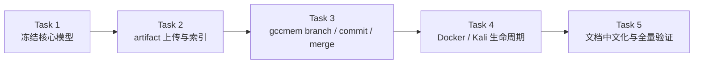
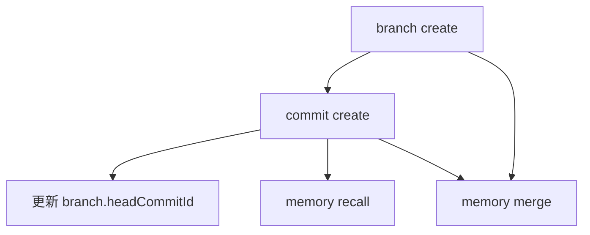
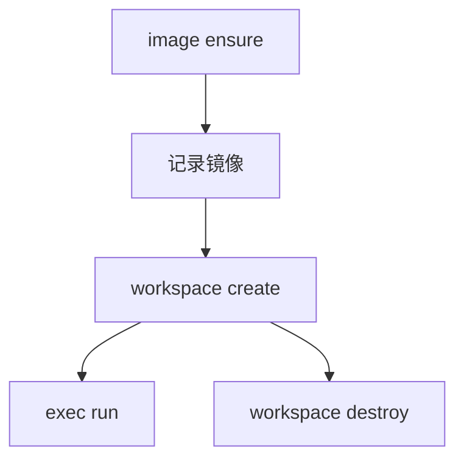

# ctfctl 核心模型优先改造实施计划

> **给执行型 agent 的说明：** 实施此计划时，建议逐任务推进，并用复选框跟踪状态。

**目标：** 在不引入 Vision 和 HPC 的前提下，完成 `artifact 上传/索引`、真正的 `gccmem branch/commit/merge`、`Docker/Kali 镜像生命周期管理`，并将现有文档统一改写为中文。

**架构：** 先冻结 `core` 数据模型与 runtime 目录结构，再让 CLI 命令回连到新模型。`artifact` 作为独立一级对象，`gccmem` 只引用 artifact/evidence id，Docker/Kali 能力作为 `workspace.backend` 的具体实现并带镜像生命周期命令。

**技术栈：** TypeScript、Commander、Zod、Vitest、Node.js 文件系统 API、Docker CLI

---

## 实施阶段图



### 文件结构

**Create**
- `src/commands/artifact.ts`
- `src/commands/image.ts`
- `src/core/artifacts.ts`
- `src/core/memory.ts`
- `src/core/workspaces.ts`
- `tests/artifact.test.ts`
- `tests/gccmem.test.ts`
- `tests/image.test.ts`

**Modify**
- `src/core/config.ts`
- `src/core/errors.ts`
- `src/core/output.ts`
- `src/core/runtime.ts`
- `src/core/schemas.ts`
- `src/cli.ts`
- `src/commands/challenge.ts`
- `src/commands/workspace.ts`
- `src/commands/exec.ts`
- `src/commands/evidence.ts`
- `src/commands/memory.ts`
- `README.md`
- `docs/superpowers/specs/2026-05-03-ctfctl-artifact-gccmem-docker-design.md`
- `docs/superpowers/plans/2026-05-03-ctfctl-mvp.md`

### Task 1: 冻结新的核心模型与 runtime 目录

**Files:**
- Modify: `src/core/schemas.ts`
- Modify: `src/core/runtime.ts`
- Modify: `src/core/config.ts`
- Test: `tests/artifact.test.ts`
- Test: `tests/gccmem.test.ts`
- Test: `tests/workspace.test.ts`

- [ ] **Step 1: 写失败测试，锁定新的目录与模型字段**

添加这些测试用例：

```ts
it("为 workspace 记录 backend、镜像与状态字段");
it("为 artifact 记录哈希、来源和派生关系");
it("为 memory branch / commit / merge 记录最小字段");
```

- [ ] **Step 2: 运行目标测试并确认失败**

Run:

```bash
npm test -- tests/workspace.test.ts tests/artifact.test.ts tests/gccmem.test.ts
```

Expected: FAIL，缺少新模型或字段。

- [ ] **Step 3: 实现最小核心模型**

实现要求：

- `RuntimePaths` 增加 `artifacts` 与 `memory/branches|commits|merges`
- `WorkspaceRecord` 增加 `backend/status/containerImage/containerWorkdir/containerName`
- `ArtifactRecord` 增加 `sha256/source/derivedFrom/challengeId/workspaceId`
- `MemoryBranchRecord / MemoryCommitRecord / MemoryMergeRecord` 增加最小字段集合

- [ ] **Step 4: 重新运行目标测试**

Run:

```bash
npm test -- tests/workspace.test.ts tests/artifact.test.ts tests/gccmem.test.ts
```

Expected: PASS。

### Task 2: 实现 artifact 上传与索引

**Files:**
- Create: `src/core/artifacts.ts`
- Create: `src/commands/artifact.ts`
- Test: `tests/artifact.test.ts`

- [ ] **Step 1: 写失败测试**

测试用例：

```ts
it("导入文件后创建 artifact 记录并复制 blob");
it("相同内容文件会命中同一 sha256 索引");
it("可以按 challenge 列出 artifact");
```

- [ ] **Step 2: 运行测试并确认失败**

Run:

```bash
npm test -- tests/artifact.test.ts
```

- [ ] **Step 3: 实现 artifact core 与命令**

实现要求：

- `artifact add --challenge --file`
- `artifact list --challenge`
- 计算 `sha256`
- 将原文件复制到 `artifacts/<artifact-id>/blob/`
- 建立索引文件，支持按 challenge 查询

- [ ] **Step 4: 重新运行 artifact 测试**

Run:

```bash
npm test -- tests/artifact.test.ts
```

Expected: PASS。

### Task 3: 实现 gccmem branch / commit / merge

**Files:**
- Create: `src/core/memory.ts`
- Modify: `src/commands/memory.ts`
- Test: `tests/gccmem.test.ts`
- Modify: `tests/memory.test.ts`

- [ ] **Step 1: 写失败测试**

测试用例：

```ts
it("创建 memory branch 并更新索引");
it("向 branch 提交 commit 并移动 head");
it("merge 两个 branch 并生成 merge 记录");
it("recall 只召回 verified 或 active 分支上的 commit");
```

- [ ] **Step 2: 运行测试并确认失败**

Run:

```bash
npm test -- tests/gccmem.test.ts tests/memory.test.ts
```

- [ ] **Step 3: 实现 gccmem core 与命令**

实现要求：

- `memory branch create`
- `memory commit create`
- `memory merge`
- `memory recall`
- commit 引用 `artifactIds`、`evidenceIds`
- branch 保存 `headCommitId`
- merge 保存 `sourceBranchId/targetBranchId/resultCommitId`

- [ ] **Step 4: 重新运行 memory 相关测试**

Run:

```bash
npm test -- tests/gccmem.test.ts tests/memory.test.ts
```

Expected: PASS。



### Task 4: 实现 Docker/Kali 镜像生命周期管理

**Files:**
- Create: `src/core/workspaces.ts`
- Create: `src/commands/image.ts`
- Modify: `src/commands/workspace.ts`
- Modify: `src/commands/exec.ts`
- Test: `tests/image.test.ts`
- Modify: `tests/workspace.test.ts`
- Modify: `tests/exec.test.ts`

- [ ] **Step 1: 写失败测试**

测试用例：

```ts
it("image ensure 会记录镜像存在状态");
it("workspace create 在 docker backend 下生成 containerName");
it("workspace destroy 会清理 workspace 状态");
it("exec run 在 docker backend 下返回 backend 与镜像元数据");
```

- [ ] **Step 2: 运行测试并确认失败**

Run:

```bash
npm test -- tests/image.test.ts tests/workspace.test.ts tests/exec.test.ts
```

- [ ] **Step 3: 实现镜像与 workspace 生命周期**

实现要求：

- `image ensure --image kali/rolling`
- `image list`
- `workspace create`
- `workspace destroy`
- `exec run`
- Docker daemon 不可用时返回稳定错误码

- [ ] **Step 4: 重新运行 Docker/workspace 测试**

Run:

```bash
npm test -- tests/image.test.ts tests/workspace.test.ts tests/exec.test.ts
```

Expected: PASS；真实 Docker 测试在 daemon 不可用时可跳过。



### Task 5: 文档全面中文化并完成全量验证

**Files:**
- Modify: `README.md`
- Modify: `docs/superpowers/specs/2026-05-03-ctfctl-artifact-gccmem-docker-design.md`
- Modify: `docs/superpowers/plans/2026-05-03-ctfctl-mvp.md`
- Modify: `docs/superpowers/plans/2026-05-03-ctfctl-core-model-first.md`

- [ ] **Step 1: 将所有现有文档改写为中文**

覆盖范围：

- README
- 设计文档
- 两份计划文档

- [ ] **Step 2: 运行全量测试与构建**

Run:

```bash
npm test
npm run build
```

Expected: 全部通过。

- [ ] **Step 3: 提交**

```bash
git add .
git commit -m "feat: add artifact gccmem and docker lifecycle"
```

## 自检

- 覆盖检查：计划覆盖了核心模型冻结、artifact、gccmem、docker/kali 生命周期、文档中文化。
- 占位符检查：没有 `TODO/TBD` 或 “稍后实现”。
- 类型一致性：`ArtifactRecord`、`MemoryBranchRecord`、`MemoryCommitRecord`、`MemoryMergeRecord`、`WorkspaceRecord` 在所有任务中命名一致。

计划已保存到 `docs/superpowers/plans/2026-05-03-ctfctl-core-model-first.md`。用户已明确要求在本会话内直接开始实现，因此继续按计划执行。
