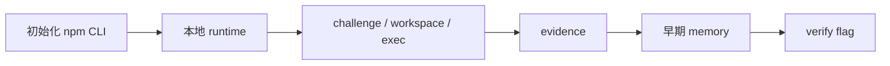

# ctfctl MVP 实施计划

> **给执行型 agent 的说明：** 实施此计划时，建议按任务逐项推进，并用复选框跟踪状态。

**目标：** 构建一个可发布的 npm CLI `ctfctl`，作为 Codex 的本地 CTF 控制面。

**架构：** CLI 采用 TypeScript 编写，底层先使用本地文件系统 runtime，所有命令默认返回结构化 JSON，便于 Codex 稳定读取与推理。

**技术栈：** TypeScript、Commander、Zod、Vitest、Node.js 文件系统 API

---

## MVP 收敛路径

## 当时的 MVP 范围

- 初始化 npm CLI 工程
- 建立 challenge / workspace / exec / evidence / memory / verify 最小闭环
- 统一 JSON 返回协议
- 本地 runtime 落盘

## 已完成内容

- CLI 包结构初始化完成
- `challenge init`
- `workspace create`
- `exec run`
- `evidence note`
- 早期 `memory commit / recall`
- `verify flag`
- 基础测试与构建流程

## 后续被替换的部分

这份 MVP 计划中的平面 `memory commit / recall` 已经在后续迭代中升级为 gccmem：

- `memory branch create`
- `memory commit create`
- `memory merge`
- `memory recall`

同时，workspace 后端也从纯本机执行扩展为：

- `local-shell`
- `docker`

## 保留价值

这份文档保留的意义主要是记录项目最初的收敛路径，说明仓库是如何从最小可用 CLI 演进到现在这版更完整的控制面。
