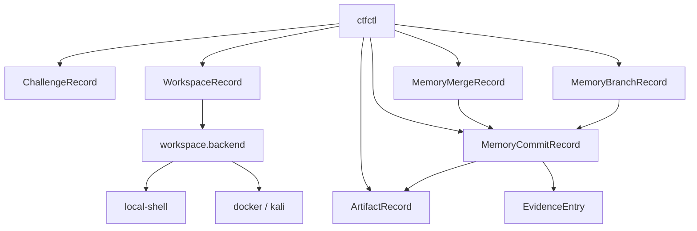
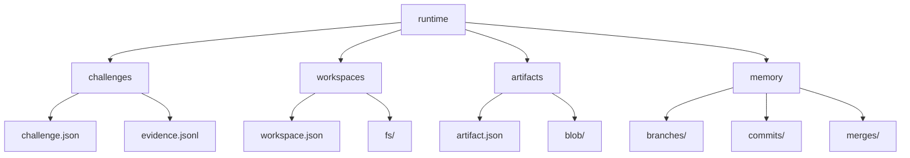

# ctfctl Artifact / GCCMem / Docker 设计草案

## 背景

当前仓库已经具备 `challenge / workspace / exec / evidence / verify` 等 CLI 基础能力，但需要补齐三个关键子系统：

- 可索引、可追踪来源链的 `artifact` 系统
- 真正带 `branch / commit / merge` 语义的 `gccmem`
- 面向 Docker/Kali 的 workspace 生命周期管理

项目最终采用了“先冻结核心模型，再回填 CLI”的策略，以减少数据结构返工。

## 系统关系图



## 最终采用的方案

项目最终采用方案三：先内核后命令式。

理由：

- 先把 runtime 和核心对象定稳，后续扩命令时就不需要重复迁移数据结构
- `artifact`、`gccmem`、`docker/kali` 三块都要落到同一套 runtime 上，模型先行更稳
- CLI 在短期内可以不完整，但对象模型一旦成形，后续迭代成本会大幅下降

## 第一阶段目标：先冻结基础模型

第一阶段不追求立即扩命令，而是先把 runtime 目录和核心对象一次性定稳。

### 推荐 runtime 目录结构

- `challenges/<challenge-id>/challenge.json`
- `challenges/<challenge-id>/evidence.jsonl`
- `workspaces/<workspace-id>/workspace.json`
- `workspaces/<workspace-id>/fs/`
- `artifacts/<artifact-id>/artifact.json`
- `artifacts/<artifact-id>/blob/<original-name>`
- `memory/branches/<branch-id>.json`
- `memory/commits/<commit-id>.json`
- `memory/merges/<merge-id>.json`
- `memory/index.json`



### 核心对象

#### ChallengeRecord

保存题目元信息、flag format、允许的范围和创建时间。

#### WorkspaceRecord

保存 challenge 归属、backend、镜像、状态、生命周期、容器名和挂载路径。

#### ArtifactRecord

保存文件哈希、来源、派生关系、所属 challenge/workspace、原始文件名和 MIME 信息。

#### MemoryBranchRecord

保存分支名、父分支、状态和头提交。

#### MemoryCommitRecord

保存 commit message、事实/假设快照、关联 evidence、关联 artifact 和父提交。

#### MemoryMergeRecord

保存 source branch、target branch、result commit 和合并摘要。

### 模型约束

- `artifact` 是独立一级对象，不嵌在 `memory` 内
- `memory commit` 只引用 artifact/evidence id
- `workspace` 生命周期与 `memory` 生命周期解耦
- `docker/kali` 只是 `workspace.backend` 的实现，不单独建顶层对象

## gccmem 分支与合并

```mermaid
gitGraph
    commit id:"base"
    branch main
    checkout main
    commit id:"commit-main-1"
    branch alt
    checkout alt
    commit id:"commit-alt-1"
    checkout main
    merge alt id:"merge-record"
```

## 已落地命令面

基于上述模型，当前已经落地的命令包括：

- `artifact add / list`
- `memory branch create`
- `memory commit create`
- `memory merge`
- `memory recall`
- `image ensure / list`
- `workspace create / destroy`
