# ctfctl 项目总览

这份文档用于快速理解 `ctfctl` 项目的全部核心信息，包括目标、架构、命令面、数据模型、runtime 结构、执行流、测试覆盖和当前限制。

## 1. 项目定位

`ctfctl` 是一个给 Codex 使用的本地 CTF 控制面 CLI。

它的职责不是替代解题推理，而是为 Codex 提供一个稳定、结构化、可审计的工具入口，让 Codex 能在受控环境里做这些事：

- 创建 challenge
- 创建和销毁 workspace
- 执行 Docker/Kali 命令
- 导入和索引 artifact
- 记录 evidence
- 管理结构化 skill
- 记录 skill trace
- 对 skill 打分并生成 proposal
- 管理 gccmem 分支、提交和合并
- 校验 flag

## 2. 全局视图

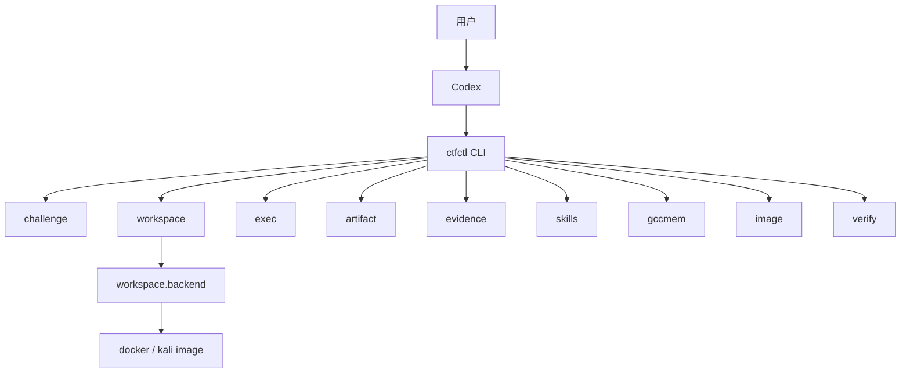

## 3. 代码结构

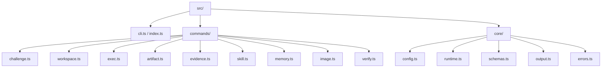

## 4. 命令能力图

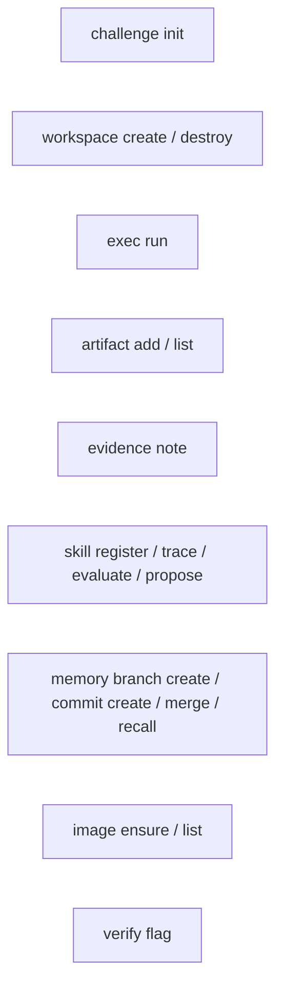

## 5. 运行时数据结构

```mermaid
flowchart TD
    Root["runtime root"] --> Challenges["challenges/"]
    Root --> Workspaces["workspaces/"]
    Root --> Artifacts["artifacts/"]
    Root --> Skills["skills/"]
    Root --> SkillTraces["skill-traces/"]
    Root --> SkillEvaluations["skill-evaluations/"]
    Root --> SkillProposals["skill-proposals/"]
    Root --> Memory["memory/"]
    Root --> Images["images.json"]

    Challenges --> ChallengeJson["<challenge-id>/challenge.json"]
    Challenges --> EvidenceJsonl["<challenge-id>/evidence.jsonl"]

    Workspaces --> WorkspaceJson["<workspace-id>/workspace.json"]
    Workspaces --> WorkspaceFs["<workspace-id>/fs/"]

    Artifacts --> ArtifactJson["<artifact-id>/artifact.json"]
    Artifacts --> ArtifactBlob["<artifact-id>/blob/<filename>"]

    Skills --> SkillJson["<skill-id>.json"]
    SkillTraces --> TraceJson["<trace-id>.json"]
    SkillEvaluations --> EvaluationJson["<evaluation-id>.json"]
    SkillProposals --> ProposalJson["<proposal-id>.json"]

    Memory --> Branches["branches/<branch-id>.json"]
    Memory --> Commits["commits/<commit-id>.json"]
    Memory --> Merges["merges/<merge-id>.json"]
```

## 6. 核心对象关系

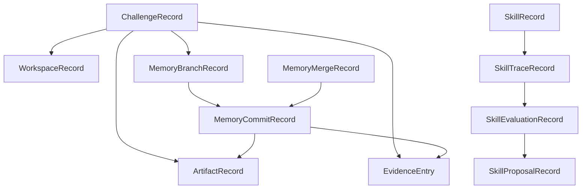

## 7. gccmem 工作流

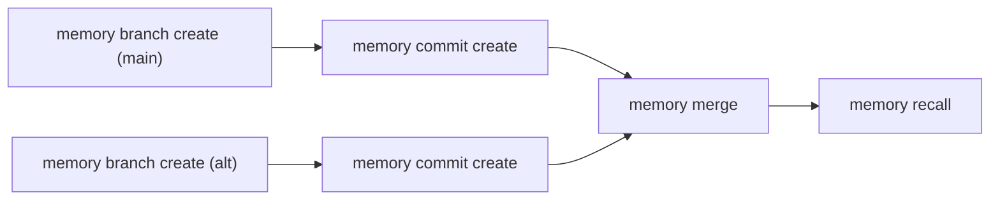

## 8. skills 自进化工作流

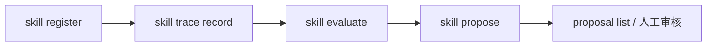

## 9. 执行流

### 8.1 Docker / Kali 执行

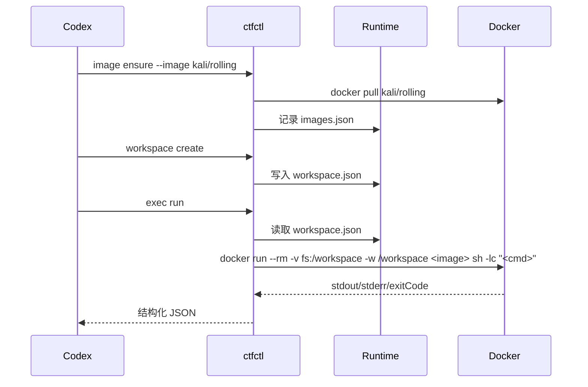

## 10. 输出协议

所有命令使用统一 envelope。

成功：

```json
{
  "ok": true,
  "data": {},
  "meta": {
    "schemaVersion": "1",
    "command": "artifact add"
  }
}
```

失败：

```json
{
  "ok": false,
  "error": {
    "code": "WORKSPACE_NOT_FOUND",
    "message": "Workspace not found: ws-123"
  },
  "meta": {
    "schemaVersion": "1",
    "command": "exec run"
  }
}
```

## 11. 当前支持的后端

### `docker`

- 使用 `docker run --rm`
- 以临时容器方式执行命令
- 通过挂载 workspace 目录共享文件
- 默认镜像为 `kali/rolling`
- 可替换为其他镜像
- `workspace.backend` 固定为 `"docker"`
- `workspace destroy` 仅改变状态，不删除 workspace 文件

## 12. 配置系统

项目现在优先使用 CLI 管理配置，而不是要求用户单独设置环境变量。

### 非交互式配置

- `config show`
- `config get <key>`
- `config set <key> <value>`
- `config unset <key>`

### 交互式配置

- `setup`

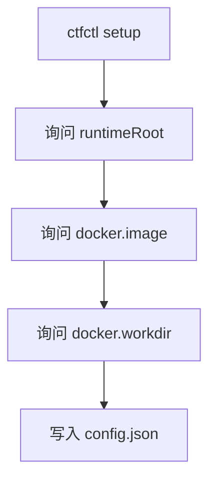

默认配置：

- `runtimeRoot = <当前工作目录>/.ctfctl-runtime`
- `backend = docker`
- `docker.image = kali/rolling`
- `docker.workdir = /workspace`

环境变量现在只作为兼容覆盖层保留。

## 13. 测试覆盖

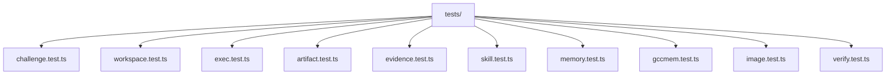

目前测试覆盖的重点包括：

- challenge 创建
- workspace 创建与销毁
- Docker 执行路径
- artifact 导入与列出
- skill 注册、trace、评分与 proposal
- gccmem 分支、提交、合并与召回
- 镜像记录
- flag 校验

注：真实 Docker 测试在本机 daemon 不可用时会跳过。

## 14. 当前限制

- 还没有 Vision
- 还没有 HPC
- artifact 目前尚未做跨 challenge 去重索引
- skill proposal 目前不会自动发布，也不会自动改写 skill
- evaluator 目前是规则驱动评分，不是回放式评估
- gccmem 目前已有 branch/commit/merge，但 recall 还较简单
- Docker/Kali 生命周期目前是临时运行模式，不是长驻隔离工作容器
- repository skill 目前只定义了启动与工作流，不包含自动评估 solve 质量的闭环
- config 已支持 CLI 管理，但还没有 profile、多环境与配置导入导出
- 没有网络 allowlist、资源配额、TTL 回收等更强控制

## 15. 当前最重要的后续方向

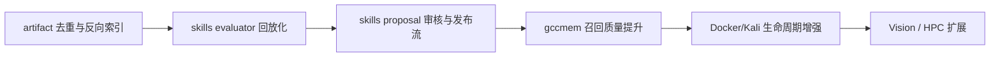

建议优先顺序：

1. `artifact` 去重索引与派生链查询
2. `skills evaluator` 从规则评分升级到回放式评估
3. `skills proposal` 增加审核与发布流
4. `gccmem recall` 按分支状态和验证状态过滤
5. `workspace` 与 `docker/kali` 的更完整生命周期管理
6. Vision 与 HPC
